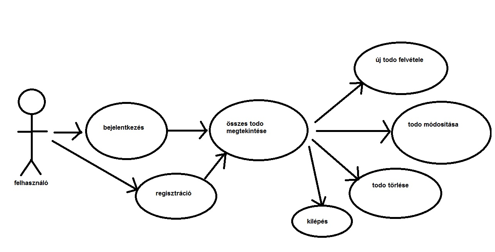
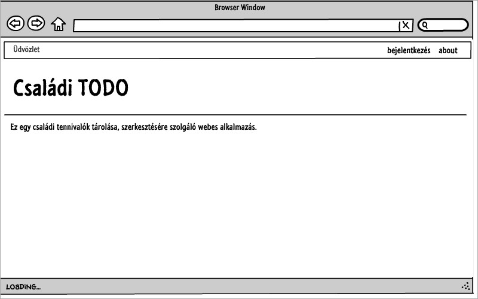
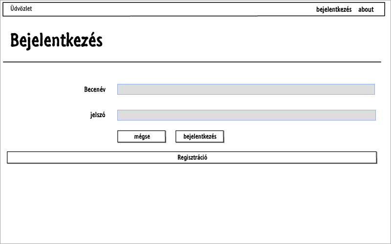
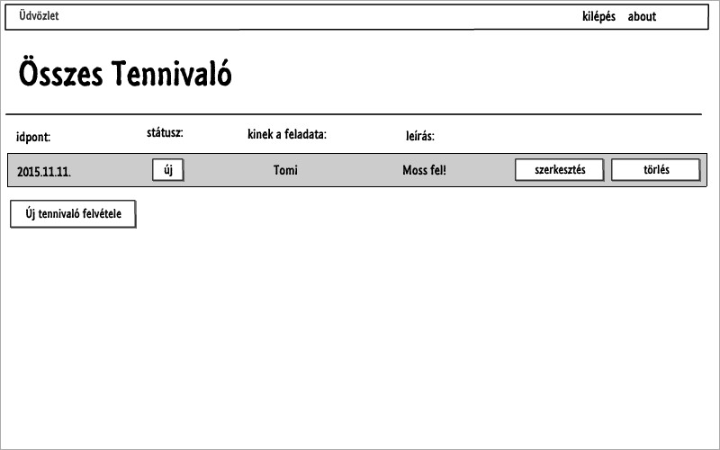
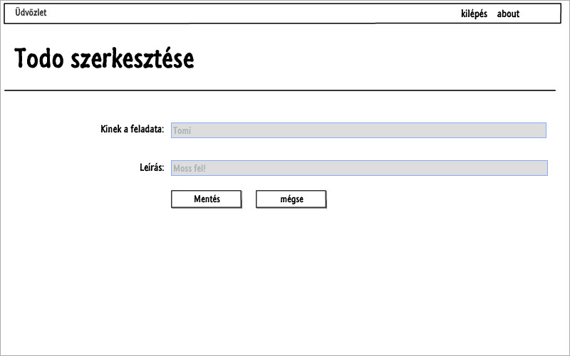
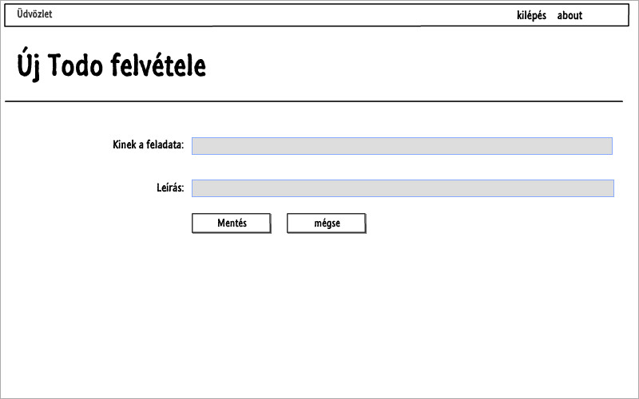
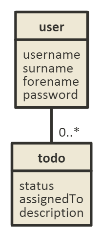

#1. beadandó dokumentációja

##1. Követelmény analízis

**Funkcionális elvárások:**

A webes alkalmazás amit készítünk egy egyszerű családok számára használható TODO (tennivalók kigyűjtése) program. Az alkalmazás használatához a család tagonknak először regisztrálniuk kell (jelszó és felhasználónév választás után), majd be kell lépniük a saját felhasználói adataikkal. Ezután el kell tudni érniük az aktuális tennivalók listáját, ezeket tudniuk kell szerkeszteni és törölni. 

**Nem funkcionális követelmények:**

A perzisztálásnak file-ba kell történnie és a program közzétételére a HERUKO platformot kell használni.

**Szakterületi fogalomjegyzék:**

- user: Az adatbázisban tárolt felhasználók (a hozzájuk tartozó felhasználói adatokkal)
- todo: Az adatbázisban tárolt tennivalók elnevezése.

**Használati eset modell:**

Szerep körök:

A program user típusú adatokat tárol, nekik van jogosultságok megtekinteni és szerkeszteni, valamint törölni todo-kat. Amikor elkezdjük használni a programot, akkor a usernek lehetősége van meglévő adatokkal belélpni, vagy regisztrálni. Mind a kettő után a felhasználó eléri az összes todo-t. Ezek után lehetősége van szerkeszteni ezeket, törölni őket, vagy újakat létrehozni, vagy kilépni.  

Használati eset diagram:

Egy folyamat ismertetése:

A felhasználó a program használatakor először egy üdvözlő oldalra kerül, innen a bejelentkezés gombra kattintva átkerül a bejelentkező oldalra. Ha nem regisztrált a felhasználó, akkor a bejelentkező oldalról egy "regisztráció" gomb egy regisztráció oldalra irányítja. Itt az adatok megadása után a "Submit" gombra kattintva megtörténik a regisztráció és visszadobja a felhasználót a program a bejelentkező oldalra. (Értelem szerűen ha már regisztrált a felhasználó, akkor a bejelentkező oldalról egyből beléphet.) Ha sikeresen beléptünk, elérjük az összes TODO-t egy oldalon listázva. Minden TODO-hoz tartozik egy szerkesztés és egy törlés gomb. A szerkesztés gombra kattintva értelem szerűen az adott TODO leírása szerkeszthető és az, hogy kinek a feladata az adott TODO. Ha elmentettük a módosításokat akkor visszakerülünk a lista oldalra, ahol már a módosított adatokkal jelenik meg a TODO. Értelem szerűen a törlés gomb törli az adott TODO-t. Megtalálható továbbá még a lista oldalon egy "Új TODO felvétele" gomb, ami a szerkesztő oldalhoz hasonló oldalra irányít, ahol egy teljesen új TODO vehető fel. Ha elmentettük, akkor visszakerülünk a lista oldalra. Minden oldalról kijelentkezhetünk a jobb felső sarokban látható "kijelentkezés" gombbal.

##2. Tervezés

**Architecktúra terv:**

Az alkalmazás egy Javascript alapú HTML, waterline, sails, express, és mocha technológiákat használó program. Az alapvető működésért egy szerver szolgál, aminek a kódját a server.js tartalmazza. Ebben tároljuk a különböző végpontokért felelő controllereket, amiket a saját "controllers" almappában elhelyezett .js-fájlokból nyer ki a server.js. Ez szerver felel a titkosítási technológinak a helyes használatáért is (bcrypt).

Oldal térkép:

Végpontok:

- /login                A bejelentkezés oldala
- /login/signup         A regisztráció oldala
- todos/list            A listázó oldal
- todos/new             Az új TODO felvétele oldal
- todos/edit/:id        A TODO szerkesztése oldal
- todos/delete/:id      A TODO törlése oldal

**Felhasználóifelület-modell**

Oldal vázlatok:

Első oldal:

Bejelentkező oldal:

Regisztráció oldal:

Listázó oldal:

Szerkesztő oldal:

Új TODO felvétele oldal:

**Adatmodell**

##3. Implementálás

Fejlesztői környezet:

A fejlesztés a cloud 9 felületén zajlott.

Mappa szerkezet:

